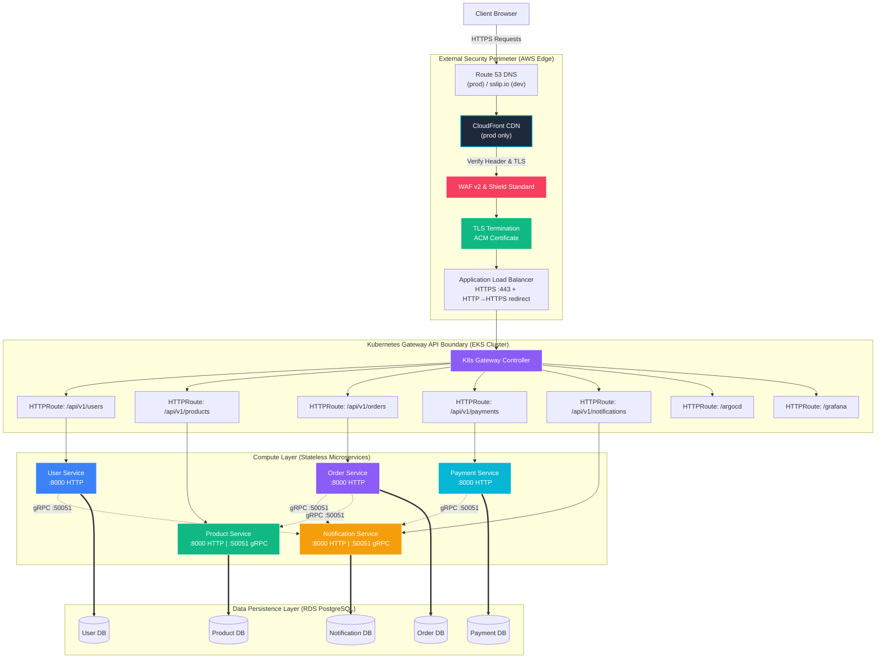
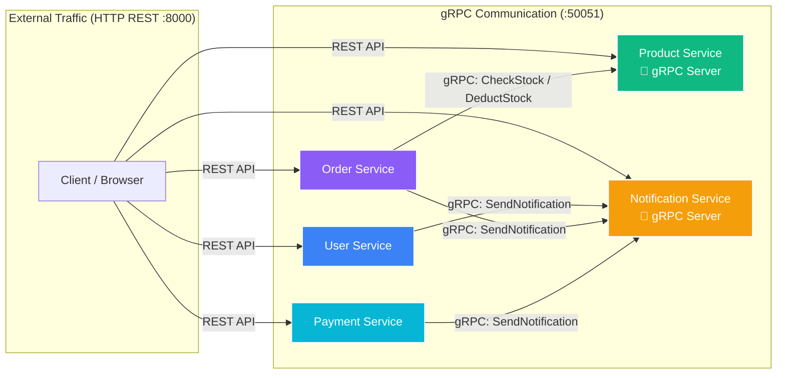
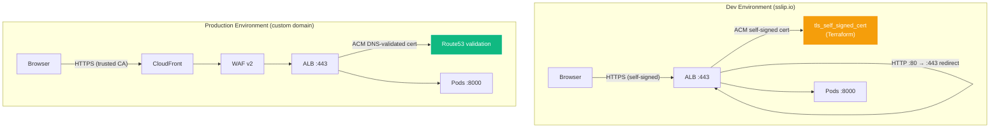
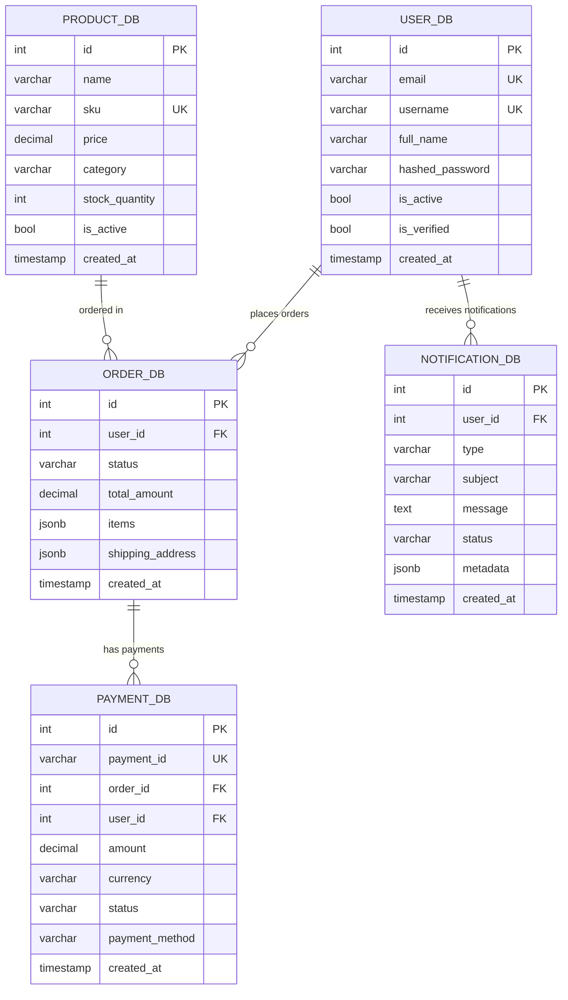
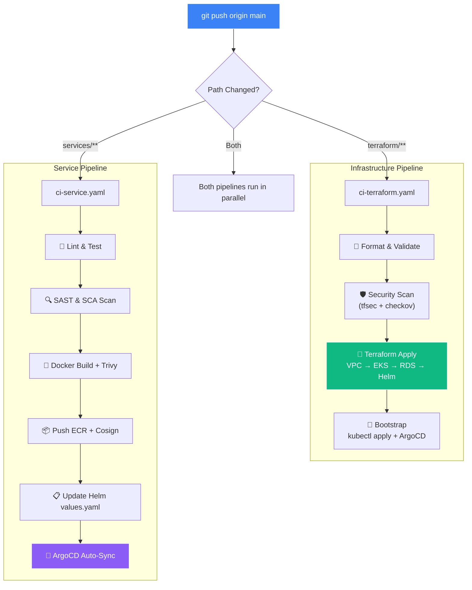
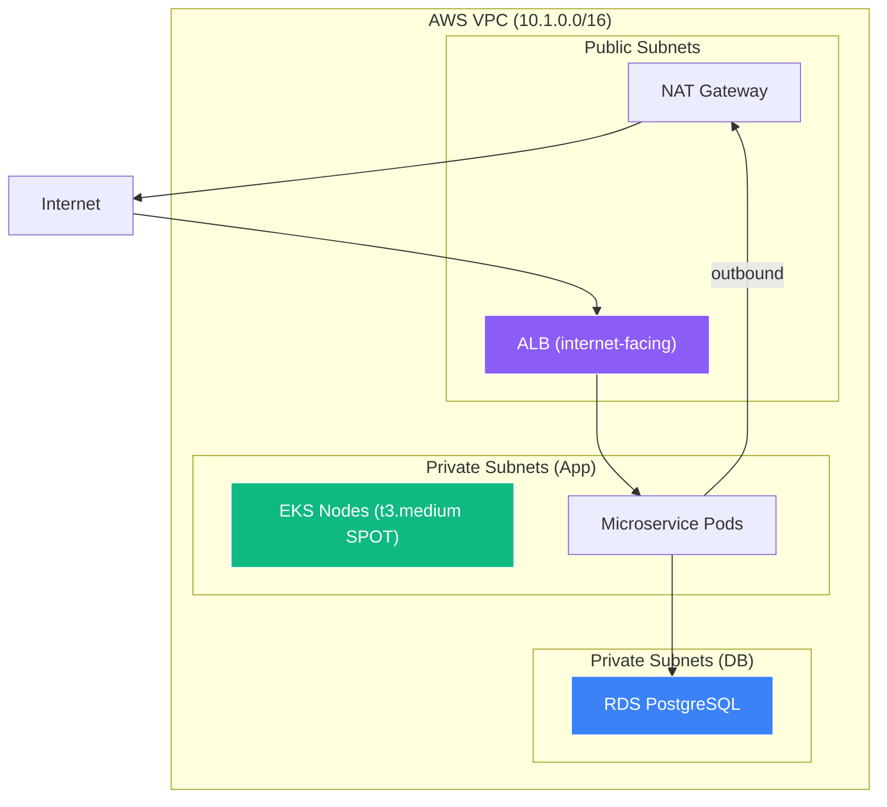

# 📐 E-Commerce Platform - System Design & Architecture Spec

This specification document outlines the system design, microservice patterns, perimeter routing security, data isolation strategies, and scalability boundaries of the E-Commerce Microservices Platform.

---

## 1. 🏗️ High-Level System Architecture

The platform follows a modern cloud-native architecture, incorporating **Security-at-Perimeter**, **Stateless Compute**, **gRPC Inter-Service Communication**, and **Database-per-Microservice** design patterns.

---

## 2. 🔄 gRPC Inter-Service Communication

Services communicate internally via **gRPC** (port 50051) for low-latency, type-safe calls. External clients use HTTP/REST (port 8000).

### gRPC Service Contracts

| Proto File | gRPC Server | gRPC Clients | Methods |
|:---|:---|:---|:---|
| `notification.proto` | notification-service | user, order, payment | `SendNotification`, `SendBulkNotification` |
| `product.proto` | product-service | order-service | `GetProduct`, `CheckStock`, `DeductStock` |

---

## 3. 🧩 Core Architectural Design Decisions

### A. Database-per-Microservice Pattern
To avoid tight coupling and single-point-of-failures, the platform enforces strict data boundaries:
*   **Encapsulation**: Each microservice (`user`, `product`, `order`, `payment`, `notification`) connects **only** to its own isolated database instance/schema on the RDS PostgreSQL cluster.
*   **Independent Schemas**: No database joins are allowed across domain boundaries. If a service needs data from another domain, it communicates via **gRPC** (internal) or REST HTTP (external).
*   **Trade-off & Mitigation**:
    *   *Challenge*: Querying aggregated data (e.g., retrieving an order with complete user and product details) requires API stitching.
    *   *Design Solution*: The frontend handles client-side aggregation. Services use gRPC for high-performance internal data exchange (stock validation, notification dispatch).

### B. Dual-Protocol Architecture (HTTP + gRPC)
*   **External API**: FastAPI (HTTP :8000) serves client-facing REST endpoints with Swagger docs
*   **Internal Communication**: gRPC (:50051) handles service-to-service calls with type-safe protobuf contracts
*   **Benefits**: 10x faster than REST for internal calls, binary serialization, streaming support, auto-generated client stubs

### C. Ingress Routing: Kubernetes Gateway API
The EKS cluster utilizes the next-generation **Kubernetes Gateway API** instead of standard legacy Ingress:
*   **Decoupled Roles**: Separates infrastructure provisioning (handled by the `Gateway` resource, mapped to the AWS ALB Controller) from routing logic (handled by individual `HTTPRoute` resources managed by development teams).
*   **Path-Based Dispatch**: Consolidates multiple domain routes onto a single ALB endpoint. This minimizes costs (saving ~$36/month per route compared to classic ELB-per-service topologies).
*   **TLS Termination**: ALB terminates HTTPS using an ACM certificate (self-signed for dev, DNS-validated for prod).

### D. Security-at-Depth & Perimeter Defense
Every layer of the request life-cycle enforces strict security controls:
1.  **TLS Encryption**: ALB terminates HTTPS with ACM certificate. HTTP→HTTPS redirect enforced.
2.  **Edge Protection** (prod): CloudFront CDN enforces SSL/TLS termination, edge caching, and custom header validation.
3.  **Firewall Auditing**: AWS WAF v2 applies OWASP protection rules, SQLi detection, and rate-limiting.
4.  **DDoS Protection**: Shield Standard (free, automatic) protects all AWS resources.
5.  **Cluster Zero-Trust**: Kubernetes NetworkPolicies restrict pod-to-pod traffic. gRPC port 50051 only open to services in the `ecommerce` namespace.
6.  **No Stored Keys**: OIDC federation for CI/CD (GitHub Actions) and IRSA for pod-level AWS access.

---

## 4. 🔐 TLS Architecture (Dev vs Production)

| Feature | Dev | Production |
|:---|:---|:---|
| **Domain** | `*.sslip.io` (free) | Custom domain via Route53 |
| **Certificate** | Self-signed (ACM import) | DNS-validated (ACM managed) |
| **TLS Version** | TLS 1.2+ | TLS 1.3 |
| **CDN** | None (direct ALB) | CloudFront |
| **Cost** | $0 | ~$36/mo (CloudFront + Route53) |

---

## 5. 💾 Data Topology & Models Spec

The system stores domain models across distinct, optimized relational tables:

| Database | Main Tables | Primary Purpose | Key Fields |
| :--- | :--- | :--- | :--- |
| **user_service** | `users` | Identity, authentication, profiles | `email` (Unique), `username` (Unique), `hashed_password` (SHA-256) |
| **product_service** | `products` | Catalog listing, pricing, stock levels | `sku` (Unique), `price` (Decimal), `stock_quantity` (Integer) |
| **order_service** | `orders` | Cart processing and checkout records | `user_id` (Index), `total_amount` (Decimal), `items` (JSONB) |
| **payment_service** | `payments` | Audit trail of financial transactions | `payment_id` (Unique), `order_id` (Index), `status` (Enum) |
| **notification_service** | `notifications` | Alert dispatch records (Email, SMS) | `user_id` (Index), `type` (Enum), `status` (Enum) |

---

## 6. 🏗️ CI/CD Pipeline Architecture

---

## 7. 📈 Horizontal Scalability & Fault Tolerance

### Stateless Compute
All microservices are fully **stateless**. No session state is held in the containers.
*   **Client Session**: Authenticated user payload and shopping cart items are held in the client's web browser (`localStorage` / SPA memory), and credentials are sent on each transaction.
*   **Autoscaling**: EKS node pools and pods automatically scale up using a Horizontal Pod Autoscaler (HPA) tracking resource utilization thresholds (CPU > 80% or Memory > 85%).
*   **Self-Healing**: If a container crashes, K8s automatically terminates it and starts a healthy replacement, routing traffic only after the `/readyz` probe returns success.

### Database High Availability
*   **Multi-AZ Clustering**: The production PostgreSQL instance runs in a Multi-AZ cluster. Reads and writes land on the primary database, while changes are synchronously replicated to a standby database in a separate availability zone.
*   **Automatic Failover**: If the primary database zone experiences an outage, AWS Route 53 DNS automatically points the database endpoint to the standby zone within seconds with zero developer intervention.

---

## 8. 🌐 Network Architecture

---

## 9. 💰 Cost Comparison (Dev vs Production)

| Resource | Dev (sslip.io) | Production |
|:---|:---|:---|
| **Domain** | sslip.io (free) | Route53 ($0.50/mo) |
| **TLS Certificate** | Self-signed ACM (free) | DNS-validated ACM (free) |
| **CDN** | None | CloudFront (~$5-36/mo) |
| **EKS Nodes** | 2× t3.medium SPOT (~$30/mo) | 3× m6i.xlarge ON_DEMAND (~$300/mo) |
| **RDS** | db.t4g.medium Single-AZ (~$49/mo) | db.r6g.large Multi-AZ (~$300/mo) |
| **Shield** | Standard (free) | Advanced ($3,000/mo) |
| **WAF** | Optional | $5/mo + $1/rule |
| **NAT Gateway** | Single (~$32/mo) | HA per-AZ (~$96/mo) |
| **Estimated Total** | **~$110/mo** | **~$3,700/mo** |
