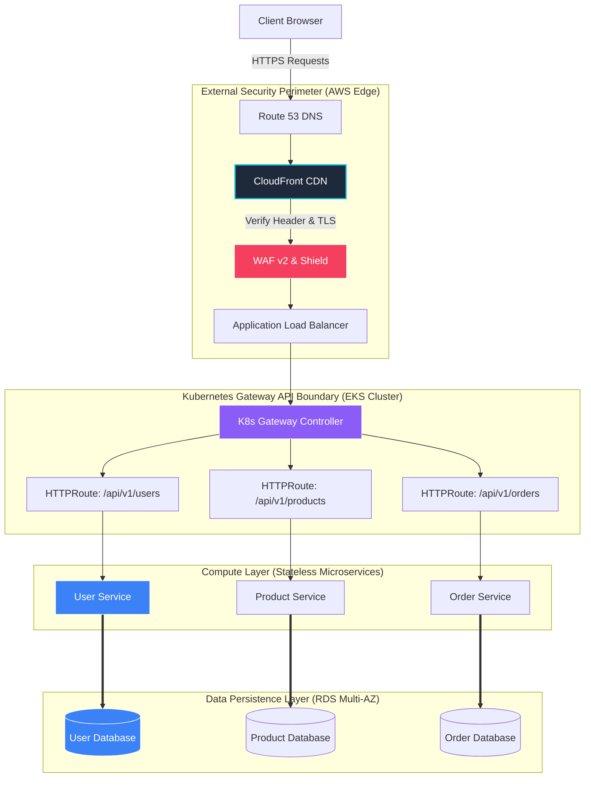

# 📐 E-Commerce Platform - System Design & Architecture Spec

This specification document outlines the system design, microservice patterns, perimeter routing security, data isolation strategies, and scalability boundaries of the E-Commerce Microservices Platform.

---

## 1. 🏗️ High-Level System Architecture

The platform follows a modern cloud-native architecture, incorporating **Security-at-Perimeter**, **Stateless Compute**, and **Database-per-Microservice** design patterns.



---

## 2. 🧩 Core Architectural Design Decisions

### A. Database-per-Microservice Pattern
To avoid tight coupling and single-point-of-failures, the platform enforces strict data boundaries:
*   **Encapsulation**: Each microservice (`user`, `product`, `order`, `payment`, `notification`) connects **only** to its own isolated database instance/schema on the RDS PostgreSQL cluster.
*   **Independent Schemas**: No database joins are allowed across domain boundaries. If a service needs data from another domain, it must communicate via REST HTTP APIs (or message queues in event-driven systems).
*   **Trade-off & Mitigation**:
    *   *Challenge*: Querying aggregated data (e.g., retrieving an order with complete user and product details) requires API stitching.
    *   *Design Solution*: The frontend or an API gateway handles client-side aggregation, and services leverage lightweight connection pools (`min_size=1, max_size=5` in local dev) to avoid DB thread starvation.

### B. Ingress Routing: Kubernetes Gateway API
The EKS cluster utilizes the next-generation **Kubernetes Gateway API** instead of standard legacy Ingress:
*   **Decoupled Roles**: Separates infrastructure provisioning (handled by the `Gateway` resource, mapped to the AWS ALB Controller) from routing logic (handled by individual `HTTPRoute` resources managed by development teams).
*   **Path-Based Dispatch**: Consolidates multiple domain routes onto a single ALB endpoint. This minimizes costs (saving ~$36/month per route compared to classic ELB-per-service topologies) while ensuring clear ingress namespaces.

### C. Security-at-Depth & Perimeter Defense
Every layer of the request life-cycle enforces strict security controls:
1.  **Edge Protection**: CloudFront CDN enforces SSL/TLS termination, edge caching, and automatically validates custom headers. ALB drops any request that doesn't originate through the CloudFront CDN boundary.
2.  **Firewall Auditing**: AWS WAF v2 applies OWASP protection rules, checks for SQL Injection (SQLi) attacks, and applies automated rate-limiting to prevent brute-force attacks on the auth endpoints.
3.  **Cluster Zero-Trust**: In-cluster traffic is restricted by **Kubernetes NetworkPolicies**. Pods are isolated; for example, the `notification-service` only accepts ingress traffic from the `user-service` and rejects all other lateral connections by default.
4.  **No Stored Keys**: Cloud services and pipelines utilize OpenID Connect (OIDC) identity federation. Neither GitHub Actions nor the EKS pods use long-lived AWS keys, neutralizing supply chain credential theft risks.

---

## 3. 💾 Data Topology & Models Spec

The system stores domain models across distinct, optimized relational tables:

```
                  ┌─────────────────────────────────┐
                  │          USER DATABASE          │
                  │  - users (id, email, password)  │
                  └─────────────────────────────────┘
                                   │
                                   ▼
┌─────────────────────────────────┐ ┌─────────────────────────────────┐
│        ORDER DATABASE           │ │        PRODUCT DATABASE         │
│  - orders (id, user_id, status) │ │  - products (id, sku, stock)    │
└─────────────────────────────────┘ └─────────────────────────────────┘
                 │                                   │
                 ▼                                   ▼
┌─────────────────────────────────┐ ┌─────────────────────────────────┐
│        PAYMENT DATABASE         │ │      NOTIFICATION DATABASE      │
│  - payments (id, transaction)   │ │  - notifications (id, status)   │
└─────────────────────────────────┘ └─────────────────────────────────┘
```

| Database | Main Tables | Primary Purpose | Key Fields |
| :--- | :--- | :--- | :--- |
| **user_service** | `users` | Identity, authentication, profiles | `email` (Unique), `username` (Unique), `hashed_password` (SHA-256) |
| **product_service** | `products` | Catalog listing, pricing, stock levels | `sku` (Unique), `price` (Decimal), `stock_quantity` (Integer) |
| **order_service** | `orders` | Cart processing and checkout records | `user_id` (Index), `total_amount` (Decimal), `items` (JSONB) |
| **payment_service** | `payments` | Audit trail of financial transactions | `payment_id` (Unique), `order_id` (Index), `status` (Enum) |
| **notification_service** | `notifications` | Alert dispatch records (Email, SMS) | `user_id` (Index), `type` (Enum), `status` (Enum) |

---

## 4. 📈 Horizontal Scalability & Fault Tolerance

### Stateless Compute
All microservices are fully **stateless**. No session state is held in the containers.
*   **Client Session**: Authenticated user payload and shopping cart items are held in the client's web browser (`localStorage` / SPA memory), and credentials are sent on each transaction.
*   **Autoscaling**: EKS node pools and pods automatically scale up using a Horizontal Pod Autoscaler (HPA) tracking resource utilization thresholds (CPU > 80% or Memory > 85%).
*   **Self-Healing**: If a container crashes, K8s automatically terminates it and starts a healthy replacement, routing traffic only after the `/readyz` probe returns success.

### Database High Availability
*   **Multi-AZ Clustering**: The production PostgreSQL instance runs in a Multi-AZ cluster. Reads and writes land on the primary database, while changes are synchronously replicated to a standby database in a separate availability zone.
*   **Automatic Failover**: If the primary database zone experiences an outage, AWS Route 53 DNS automatically points the database endpoint to the standby zone within seconds with zero developer intervention.
