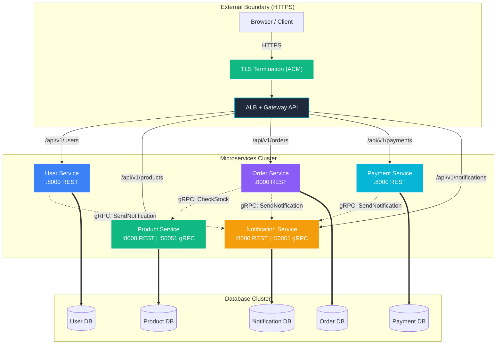

# ☁️ Cloud Migration & Microservices Architecture Guide

This comprehensive document details the system architecture of the E-Commerce Platform, explaining the AWS services utilized in the modular Terraform infrastructure, comparing local vs. production microservices communication, and providing a step-by-step roadmap to migrate from local Docker Compose to the AWS Cloud.

> **Key Update:** The entire cloud migration is now **fully automated via GitHub Actions**. Infrastructure provisioning, Helm chart installation, and ArgoCD bootstrapping all happen automatically on `git push` to `main`.

---

## 1. 🛠️ AWS Services Covered in the Project

The Terraform configuration (`/terraform/`) defines a production-grade, highly available, secure, and cost-optimized cloud topology. Below are the core AWS services covered in the codebase:

### Networking & Content Delivery
*   **AWS VPC (Virtual Private Cloud)**: Modular network isolation with public, private (app), and database subnets across 2+ Availability Zones (AZs). Includes NAT Gateways (HA per-AZ in production, single NAT in dev to save cost).
*   **Amazon Route 53** (production only): DNS management mapping custom domains to the ALB. Dev uses **sslip.io** free domains instead ($0 cost).
*   **AWS Certificate Manager (ACM)**: TLS certificates for HTTPS termination at the ALB.
    *   **Dev**: Self-signed certificate generated by Terraform (`tls_self_signed_cert`) and imported into ACM. Free, no DNS validation needed.
    *   **Prod**: DNS-validated certificate via Route53. Free, auto-renewing.
*   **Amazon CloudFront** (production only): Global CDN with custom header validation for origin protection. Not used in dev to save costs.

### Compute & Orchestration
*   **Amazon EKS (Elastic Kubernetes Service) v1.31**: Managed K8s cluster orchestrating the 5 FastAPI microservices.
    *   **Dev**: Cost-saving `t3.medium` SPOT instances with auto-scaling.
    *   **Production**: High-availability `ON_DEMAND` instances across 3 AZs.
*   **Amazon ECR (Elastic Container Registry)**: Private Docker registries with Trivy scanning and cosign image signing.

### Databases & Security
*   **Amazon RDS (PostgreSQL 16)**: Relational database with Multi-AZ replication in production.
*   **AWS WAF v2**: OWASP protection, SQLi detection, and rate-limiting.
*   **AWS Shield Standard**: Free, automatic DDoS protection on all AWS resources. Module supports upgrading to Shield Advanced ($3,000/mo) for production.
*   **AWS KMS**: Customer-managed encryption keys for RDS and EKS secrets.
*   **AWS IAM & OIDC**: Keyless authentication — GitHub Actions OIDC + EKS IRSA.
*   **Amazon S3**: Terraform state storage and Loki log backend.

### In-Cluster Platform Services (Installed via Terraform Helm Provider)
All platform tools are installed as Helm releases by Terraform (`/terraform/modules/helm-releases/`) **after** the EKS cluster is created:

| Tool | Namespace | Installed By |
| :--- | :--- | :--- |
| **ArgoCD** | `argocd` | `helm_release.argocd` |
| **kube-prometheus-stack** | `monitoring` | `helm_release.prometheus` |
| **Grafana** | `monitoring` | `helm_release.grafana` |
| **Loki** | `monitoring` | `helm_release.loki` |
| **Promtail** | `monitoring` | `helm_release.promtail` |
| **AWS Load Balancer Controller** | `kube-system` | `helm_release.aws_lb_controller` |
| **Cert Manager** | `cert-manager` | `helm_release.cert_manager` |
| **External Secrets** | `external-secrets` | `helm_release.external_secrets` |
| **Metrics Server** | `kube-system` | `helm_release.metrics_server` |
| **Gateway API CRDs** | `gateway-system` | `helm_release.gateway_api_crds` |

---

## 2. 🔌 Microservices Communication Flow

The 5 FastAPI microservices use a **dual-protocol architecture**: HTTP/REST for external clients, **gRPC** for internal service-to-service communication.



### 🐳 A. Local Execution (Docker Compose)
*   **Service Discovery**: Container name resolution on the `ecommerce-network` bridge.
*   **DNS Resolution**: Containers locate databases using service alias `postgres`.
*   **gRPC Communication**: Services communicate via gRPC on port 50051 within the Docker network. Environment variables control targets:
    ```
    NOTIFICATION_SERVICE_GRPC=notification-service:50051
    PRODUCT_SERVICE_GRPC=product-service:50051
    ```
*   **Host Port Mapping**: HTTP on `8001-8005`, gRPC on `50051` (notification) and `50052` (product).

### ☸️ B. Cloud Execution (Kubernetes on EKS)
*   **Service Discovery**: Kubernetes CoreDNS resolves internal names:
    ```
    notification-service.ecommerce.svc.cluster.local:50051  (gRPC)
    product-service.ecommerce.svc.cluster.local:50051       (gRPC)
    ```
*   **API Routing (Gateway API)**: ALB → Gateway Controller → HTTPRoutes → ClusterIP Services
*   **TLS Termination**: ALB terminates HTTPS using ACM certificate. All external traffic is encrypted.
*   **gRPC Internal**: Services call each other via gRPC (:50051) within the cluster. NetworkPolicies restrict access to the `ecommerce` namespace only.
*   **Secrets Management**: External Secrets Operator syncs credentials from AWS Secrets Manager → K8s Secrets.

---

## 3. 🚀 Step-by-Step Cloud Migration Roadmap

### Phase 1: One-Time Bootstrap (Manual)
1.  **Configure AWS CLI**: Authenticate with administrator credentials.
2.  **Create Terraform State Backend**:
    ```bash
    chmod +x scripts/setup.sh
    ./scripts/setup.sh ecommerce ap-south-1
    ```
3.  **Initial Terraform Apply** (creates VPC, EKS, RDS, ACM self-signed cert, Helm charts):
    ```bash
    cd terraform/environments/dev
    terraform init && terraform plan -out=tfplan && terraform apply tfplan
    ```
4.  **Configure GitHub Secrets**: Set `AWS_ROLE_ARN` and `AWS_REGION`.

### Phase 2: Configure TLS & sslip.io Domains
1.  **Update kubeconfig**:
    ```bash
    aws eks update-kubeconfig --name ecommerce-dev-eks --region ap-south-1
    ```
2.  **Run the setup script** (patches Gateway with ACM cert, discovers ALB IP, prints URLs):
    ```bash
    ./scripts/setup-sslip-domain.sh
    ```
3.  **Verify HTTPS**:
    ```bash
    curl -k https://ecommerce-api-<IP>.sslip.io/api/v1/users/healthz
    ```

### Phase 3: Automated Infrastructure (GitHub Actions — Ongoing)
> **From this point forward, everything is automated.**

Push changes to `main` and GitHub Actions handles Terraform Apply + Helm Releases + ArgoCD Bootstrap.

### Phase 4: Setup Secrets & Database
1.  Create secrets in AWS Secrets Manager for DB credentials.
2.  Seed RDS via a temporary pod or K8s Job using `scripts/init-db.sql`.

### Phase 5: Automated Application Deployment (ArgoCD — Ongoing)
ArgoCD detects Helm value changes, syncs pods automatically.


---

## 4. 💰 Cloud Cost Optimization & Security Checklist

| Core Requirement | AWS Implementation | Dev Config |
| :--- | :--- | :--- |
| **TLS Encryption** | ACM certificate on ALB | Self-signed (free, no Route53) |
| **Free Domains** | sslip.io wildcard DNS | `ecommerce-api-<IP>.sslip.io` |
| **DDoS Protection** | Shield Standard | Free, automatic |
| **No Stored Keys** | GitHub Actions OIDC + IRSA | Keyless auth everywhere |
| **gRPC Internal** | Protobuf service contracts | notification.proto, product.proto |
| **Low-Cost Compute** | t3.medium SPOT instances | ~$30/mo for 2 nodes |
| **Single ALB** | Gateway API path routing | Saves ~$36/mo per route |
| **Zero Secrets in Git** | External Secrets Operator | AWS Secrets Manager sync |
| **State Locking** | S3 Backend with lockfiles | Native Terraform lockfiles |
