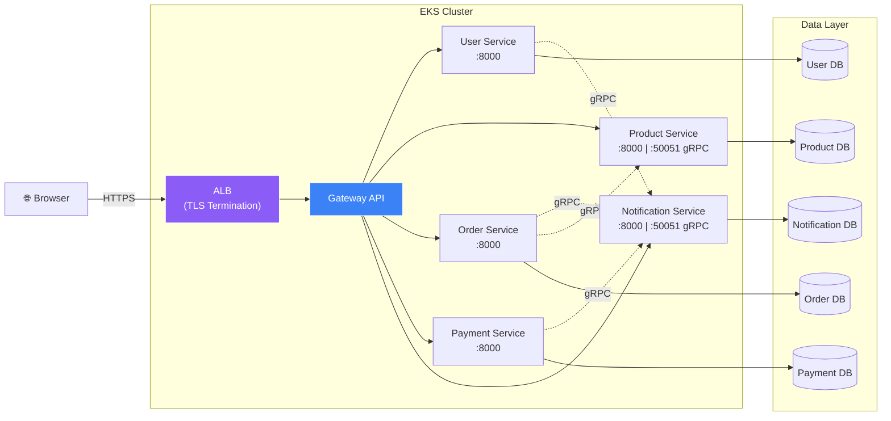
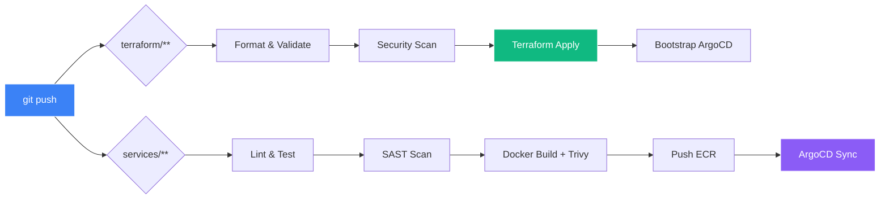

# 🛒 E-Commerce Platform - Production Microservices

Production-grade e-commerce platform with 5 microservices running on AWS EKS, managed by Terraform IaC, GitHub Actions CI/CD, and ArgoCD GitOps CD. **Fully automated: push to `main` creates the entire infrastructure and deploys all applications.**

## Architecture



### Dev Environment (Cost-Optimized)
```
Internet → sslip.io (free DNS) → ALB (HTTPS, self-signed TLS) → Gateway API → Microservices
  ├── ArgoCD:   https://ecommerce-api-<IP>.sslip.io/argocd
  ├── Grafana:  https://ecommerce-api-<IP>.sslip.io/grafana
  └── API:      https://ecommerce-api-<IP>.sslip.io/api/v1/{service}
```

### Production Environment
```
Internet → Route53 → CloudFront (WAF + Shield) → ALB (HTTPS, ACM cert) → Gateway API → Microservices
```

## CI/CD Pipeline (Fully Automated)



## Tech Stack

| Layer | Technology |
|-------|-----------|
| **Cloud** | AWS (EKS, RDS, WAF, Shield Standard, ECR, ACM, S3, KMS) |
| **IaC** | Terraform with modular architecture |
| **Orchestration** | Kubernetes (EKS v1.31) |
| **Inter-Service Comm** | gRPC (protobuf, port 50051) |
| **External API** | Python/FastAPI (REST, port 8000) |
| **CI/CD** | GitHub Actions (OIDC auth, auto-apply, Trivy scanning) |
| **CD** | ArgoCD (GitOps, App-of-Apps pattern) |
| **Monitoring** | Prometheus + Grafana (Helm via Terraform) |
| **Logging** | Loki + Promtail (S3-backed, Helm via Terraform) |
| **API Gateway** | Kubernetes Gateway API |
| **Database** | PostgreSQL 16 (RDS) |
| **TLS** | ACM (self-signed for dev, DNS-validated for prod) |
| **Domain** | sslip.io (dev, free) / Route53 (prod) |

## Microservices

| Service | External API | gRPC Server | gRPC Client Of | Description |
|---------|-------------|-------------|-----------------|-------------|
| user-service | `/api/v1/users` | — | notification | Registration, auth, profiles |
| product-service | `/api/v1/products` | `:50051` | — | Catalog, inventory, stock |
| order-service | `/api/v1/orders` | — | product, notification | Cart, checkout, orders |
| payment-service | `/api/v1/payments` | — | notification | Payment processing, refunds |
| notification-service | `/api/v1/notifications` | `:50051` | — | Email, SMS, push dispatch |

## Project Structure

```
├── terraform/                  # Infrastructure as Code
│   ├── modules/                # Reusable Terraform modules
│   │   ├── vpc/                # VPC, subnets, NAT
│   │   ├── eks/                # EKS cluster, node groups
│   │   ├── rds/                # PostgreSQL
│   │   ├── acm-self-signed/    # Self-signed TLS cert (dev)
│   │   ├── acm/                # DNS-validated cert (prod)
│   │   ├── waf/                # WAF v2 rules
│   │   ├── shield/             # Shield Standard/Advanced
│   │   ├── irsa/               # IAM Roles for Service Accounts
│   │   ├── security-groups/    # Network security
│   │   ├── github-oidc/        # GitHub Actions OIDC
│   │   └── helm-releases/      # Platform services (ArgoCD, Prometheus, etc.)
│   └── environments/           # Per-environment configs
│       ├── dev/                # sslip.io + self-signed TLS + t3.medium SPOT
│       ├── staging/
│       └── production/
├── services/                   # Microservice source code
│   ├── proto/                  # gRPC proto definitions + gen script
│   ├── user-service/           # FastAPI + gRPC client
│   ├── product-service/        # FastAPI + gRPC server
│   ├── order-service/          # FastAPI + gRPC client
│   ├── payment-service/        # FastAPI + gRPC client
│   └── notification-service/   # FastAPI + gRPC server
├── kubernetes/                 # K8s manifests (Gateway API, HTTPRoutes)
├── argocd/                     # ArgoCD application manifests
├── .github/workflows/          # CI/CD pipelines
└── scripts/                    # Setup/teardown/sslip-domain scripts
```

## Quick Start

### Prerequisites
- AWS Account with appropriate permissions
- GitHub repository with secrets configured (`AWS_ROLE_ARN`, `AWS_REGION`)
- Terraform S3 state bucket created (one-time)

### 1. One-Time Setup
```bash
chmod +x scripts/setup.sh
./scripts/setup.sh ecommerce ap-south-1
```

### 2. Deploy Infrastructure
```bash
cd terraform/environments/dev
terraform init && terraform plan -out=tfplan && terraform apply tfplan
```

### 3. Configure sslip.io + TLS
```bash
./scripts/setup-sslip-domain.sh
```

### 4. Push to Automate 🚀
```bash
git push origin main
```

## Environments

| Environment | Nodes | TLS | Domain | Shield | Estimated Cost |
|------------|-------|-----|--------|--------|---------------|
| dev | 2× t3.medium SPOT | Self-signed ACM | sslip.io (free) | Standard (free) | ~$110/mo |
| staging | 2× m6i.large ON_DEMAND | ACM DNS-validated | Custom domain | Standard (free) | ~$250/mo |
| production | 3× m6i.xlarge ON_DEMAND | ACM DNS-validated | Custom domain | Advanced ($3K/mo) | ~$3,700/mo |

## Security

- 🔐 **TLS everywhere** — HTTPS on ALB with ACM certificate (HTTP→HTTPS redirect)
- 🔐 **KMS encryption** for EKS secrets and RDS
- 🔐 **IRSA** (no AWS credentials in pods)
- 🔐 **WAF** with OWASP, SQLi, rate limiting rules
- 🔐 **Shield Standard** (automatic DDoS protection)
- 🔐 **Network policies** per service (gRPC port 50051 restricted to ecommerce namespace)
- 🔐 **GitHub OIDC** (no long-lived IAM keys)
- 🔐 **External Secrets Operator** (no secrets in Git)
- 🔐 **Non-root containers** with read-only filesystem
- 🔐 **gRPC reflection** enabled for dev debugging (disable in prod)
